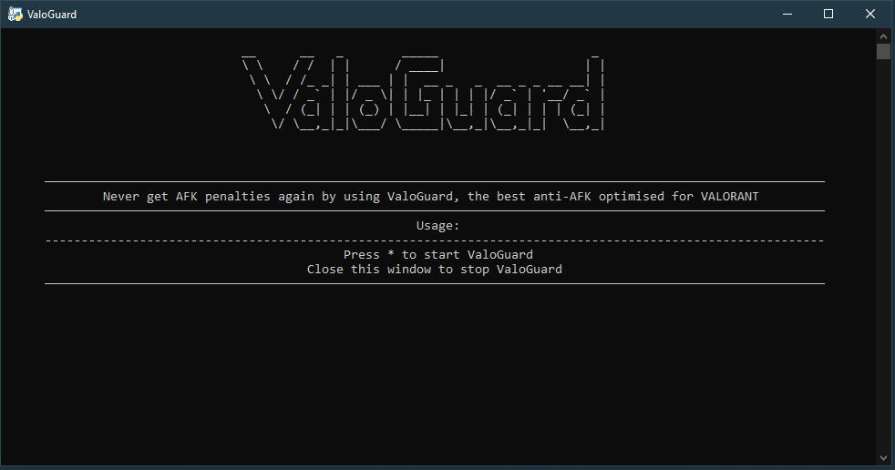

# ValoGuard
    

Never get AFK penalties again by using ValoGuard, the best anti-AFK optimized for VALORANT.
#
  
# Preview
## APP
### MAIN

## Discord RPC
### Status: Ready

### Status: Active

# Requirements

- [x] 30 MB RAM

- [x] 5 MB disk space

  

# Usage

1. Download ValoGuard

2. Execute `ValoGuard`

3. Use the * key to go AFK without getting penalties

# Features
- [x] Logs
- [x] Discord RPC
- [x] Tested in all game modes
- [x] No ban or penalties
- [x] Easy to use
  

# FAQ

  

## Can I get banned for using ValoGuard?

Activating macros that trigger actions in the game is bannable, but ValoGuard does not work in a specific pattern and has a realistic reaction time, so Vanguard cannot detect it and the security of your account is guaranteed.

**IMPORTANT:**

Remember, however, that each player is responsible for the actions on his account. If you choose to use ValoGuard, it is your responsibility if you get banned for using it. I do not take any responsibility for any damage caused.

  

## How do I stop ValoGuard?

ValoGuard stops automatically after 80 minutes, if you want to stop it earlier you have to close the ValoGuard window via the X.

  

## ValoGuard seems bugged or is not working. What should i do?
Please run `ValoGuard_debug` to fix common problems with ValoGuard. If you got a new license, you can also run it to remove your current key.

# Credits

freepik: icons

#

> Made with ♥ by Qode
